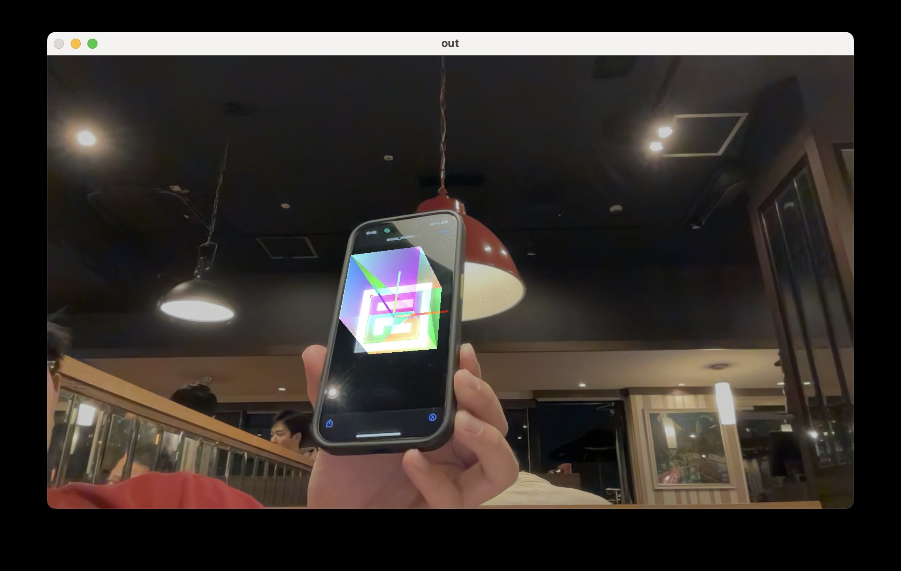

# marker-based-augumented-reality
#### Implementation of a marker based augumenty reality project based on cpp, OpenCv and OpenGL.

The camera is pre calibrated to get the intrincs. For each frame, the marker is detected and the RT matrix is calculated by SolvePnP. Then display the cube on the detected marker according to its estimated position.

**Marker used**: ArUco

