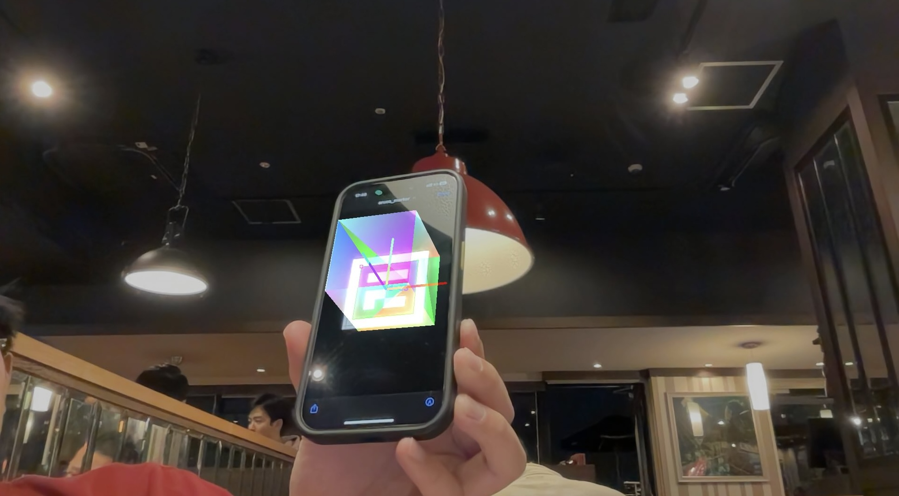

# marker-based-augumented-reality
Implementation of a marker based augumenty reality project based on cpp, OpenCv and OpenGL.

Display an object on the detected marker according to its estimated position.

